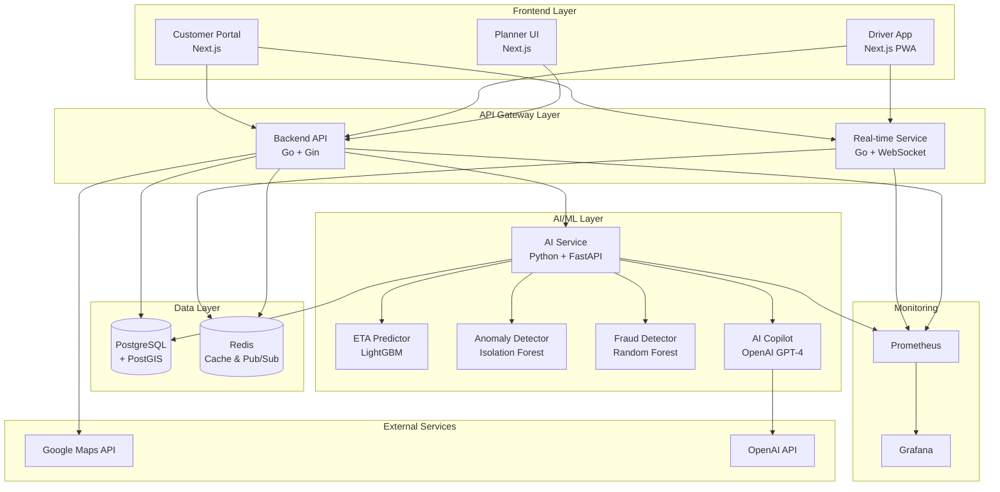

# AI-TMS Architecture

## System Overview

AI-TMS is a microservices-based Transportation Management System with AI/ML capabilities.



## Component Details

### Frontend Applications

#### 1. Planner UI (Port 3000)
- **Technology**: Next.js 14 + TypeScript + Tailwind CSS
- **Purpose**: Route planning and control tower
- **Key Features**:
  - Interactive map with route visualization
  - Drag & drop stop management
  - Plan comparison (A/B testing)
  - Real-time KPI dashboard
  - Order import (CSV/API)

#### 2. Driver App (Port 3001)
- **Technology**: Next.js 14 PWA + TypeScript
- **Purpose**: Mobile app for drivers
- **Key Features**:
  - Offline-first architecture
  - Job list with turn-by-turn navigation
  - POD capture (photos + signature)
  - Real-time GPS tracking
  - Thai language interface

#### 3. Customer Portal (Port 3002)
- **Technology**: Next.js 14 + TypeScript
- **Purpose**: Customer order tracking
- **Key Features**:
  - Real-time order tracking
  - Live ETA updates
  - Delivery timeline
  - POD download
  - Thai language support

### Backend Services

#### 1. Backend API (Port 8080)
- **Technology**: Go 1.21 + Gin Framework
- **Purpose**: Main business logic API
- **Key Features**:
  - JWT authentication
  - Role-based access control (RBAC)
  - RESTful API (40+ endpoints)
  - PostgreSQL + PostGIS integration
  - Redis caching
  - Google Maps integration

**API Modules**:
- Authentication & User Management
- Fleet Management (Vehicles, Depots)
- Driver Management
- Customer Management
- Order & Shipment Management
- Route Planning
- GPS Tracking
- Proof of Delivery
- Analytics & Reporting

#### 2. Real-time Service (Port 8081)
- **Technology**: Go 1.21 + Gorilla WebSocket
- **Purpose**: Real-time data streaming
- **Key Features**:
  - WebSocket connections
  - Redis Pub/Sub integration
  - GPS location broadcasting
  - Alert notifications
  - Low-latency updates

#### 3. AI/ML Service (Port 8000)
- **Technology**: Python 3.11 + FastAPI
- **Purpose**: AI model serving
- **Key Features**:
  - 4 ML models (ETA, Anomaly, Fraud, Copilot)
  - Model training endpoints
  - Batch prediction support
  - Model versioning
  - Performance monitoring

### AI/ML Models

#### 1. ETA Predictor
- **Algorithm**: LightGBM (Gradient Boosting)
- **Purpose**: Traffic-aware arrival time prediction
- **Features**: Distance, time of day, traffic level, weather, driver experience, customer service time
- **Output**: ETA with confidence intervals (±15%)
- **Accuracy**: MAE < 5 minutes, R² > 0.85

#### 2. Anomaly Detector
- **Algorithm**: Isolation Forest + Rule-based
- **Purpose**: Detect unusual vehicle behavior
- **Detects**:
  - Long stops (>30 min)
  - Speed violations (>100 km/h)
  - Route deviations (>2 km)
  - Stop skipping
- **Output**: Anomaly score + alerts

#### 3. POD Fraud Detector
- **Algorithm**: Random Forest + Image Hashing
- **Purpose**: Identify fake delivery proofs
- **Checks**:
  - Duplicate photos (perceptual hashing)
  - GPS spoofing detection
  - Poor GPS accuracy
  - Missing signatures
- **Output**: Fraud score (0-1) + recommendations
- **Accuracy**: AUC > 0.90

#### 4. AI Copilot
- **Algorithm**: OpenAI GPT-4
- **Purpose**: Natural language interface (Thai language)
- **Features**:
  - Answer logistics questions
  - Provide recommendations
  - Analyze KPIs
  - Suggest actions
- **Roles**: Customized responses for each user role

### Data Layer

#### PostgreSQL + PostGIS
- **Version**: PostgreSQL 15 + PostGIS 3.4
- **Purpose**: Primary data store
- **Features**:
  - Spatial data support (geo-spatial queries)
  - JSONB for flexible data
  - Full-text search
  - Partitioning for large tables
- **Schema**: 12 core models

#### Redis
- **Version**: Redis 7
- **Purpose**: Caching & real-time data
- **Use Cases**:
  - Session management
  - GPS location cache (5-min TTL)
  - Pub/Sub for real-time updates
  - Rate limiting
  - Leaderboards

### Monitoring & Observability

#### Prometheus
- **Purpose**: Metrics collection
- **Metrics**:
  - Request rate, latency, errors
  - Database query performance
  - ML model inference time
  - GPS update frequency
  - WebSocket connections

#### Grafana
- **Purpose**: Visualization & dashboards
- **Dashboards**:
  - System overview
  - API performance
  - ML model metrics
  - Business KPIs
  - Real-time tracking

## Data Flow

### 1. Order Creation Flow
```
Customer/Planner → Backend API → PostgreSQL
                              → AI Service (ETA Prediction)
                              → Google Maps (Geocoding)
```

### 2. Route Planning Flow
```
Planner UI → Backend API → VRP Solver (OR-Tools)
                        → AI Service (ETA for each stop)
                        → PostgreSQL (Save route)
```

### 3. Real-time Tracking Flow
```
Driver App → Backend API → PostgreSQL (Store GPS)
                        → Redis Pub/Sub
                        → Real-time Service → WebSocket
                        → Planner UI / Customer Portal
```

### 4. POD Submission Flow
```
Driver App → Backend API → File Storage (Photos)
                        → AI Service (Fraud Detection)
                        → PostgreSQL (POD record)
                        → Notification Service
```

### 5. Anomaly Detection Flow
```
GPS Updates → Backend API → AI Service (Anomaly Detector)
                          → Alert Service
                          → Redis Pub/Sub
                          → Real-time Service
                          → Planner UI (Alert notification)
```

## Security

### Authentication & Authorization
- JWT tokens with 24-hour expiry
- Refresh token rotation
- Role-based access control (RBAC)
- 5 roles: Admin, Planner, Dispatcher, Driver, Customer

### Data Protection
- HTTPS/TLS in production
- Environment variables for secrets
- Database connection pooling
- SQL injection prevention (parameterized queries)
- XSS protection (input sanitization)

### API Security
- Rate limiting (100 req/min per user)
- CORS configuration
- Request validation
- Error message sanitization

## Scalability

### Horizontal Scaling
- Stateless backend services
- Load balancer ready
- Redis for shared state
- Database read replicas

### Performance Optimization
- Database indexing (B-tree, GiST for spatial)
- Redis caching (5-min TTL for GPS)
- Connection pooling
- Lazy loading in frontend
- Image optimization

### High Availability
- Health checks for all services
- Automatic restart policies
- Database backups (daily)
- Redis persistence (AOF + RDB)

## Deployment

### Development
```bash
docker-compose up -d
```

### Production
- Kubernetes manifests (planned)
- CI/CD with GitHub Actions
- Blue-green deployment
- Automated testing
- Monitoring & alerting

## Technology Stack Summary

| Layer | Technology | Purpose |
|-------|-----------|---------|
| **Frontend** | Next.js 14 + TypeScript | Modern web apps |
| **Backend** | Go 1.21 + Gin | High-performance API |
| **Real-time** | Go + WebSocket | Live updates |
| **AI/ML** | Python 3.11 + FastAPI | ML model serving |
| **Database** | PostgreSQL 15 + PostGIS | Spatial data |
| **Cache** | Redis 7 | Real-time & caching |
| **Maps** | Google Maps API | Routing & geocoding |
| **AI** | OpenAI GPT-4 | Natural language |
| **ML** | LightGBM, scikit-learn | Predictive models |
| **Monitoring** | Prometheus + Grafana | Metrics & dashboards |
| **Container** | Docker + Docker Compose | Deployment |
| **CI/CD** | GitHub Actions | Automation |
